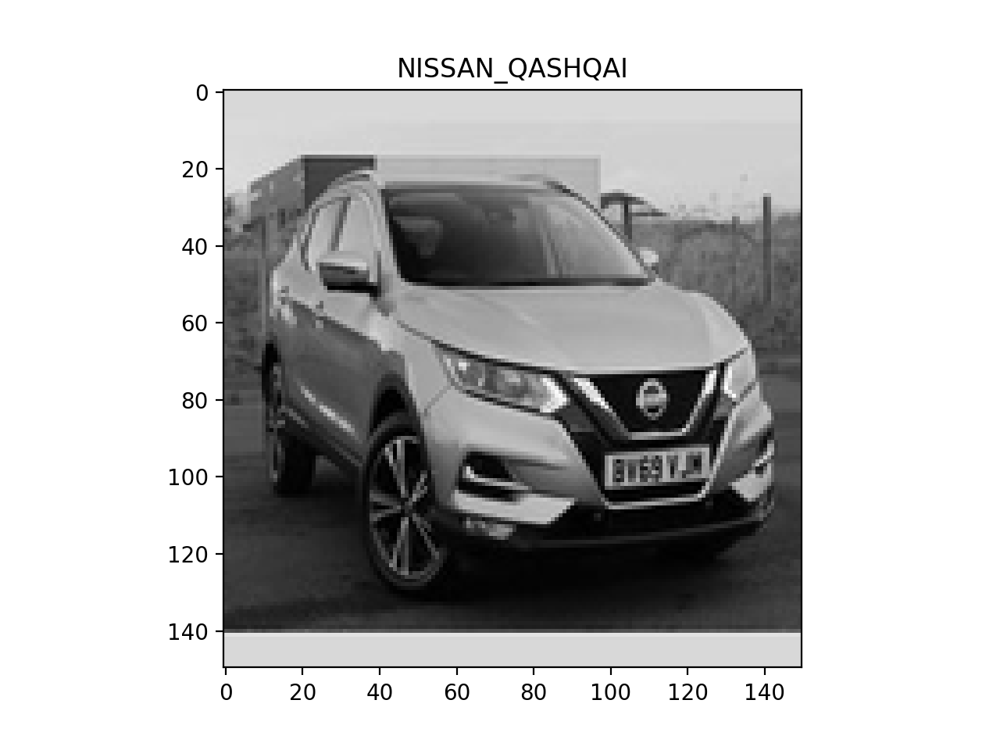

## Image Scrape

In order to get the images of cars for training a car classifier, images of 7 different cars were scraped from a popular car selling website. 
The 7 cars were; Audi A1, Ford Fiesta, Ford Kuga, Jaguar F-Pace, Nissan Qashqai, Vauxhall Corsa, Volkswagen Golf.
~380 images of each car was scraped.

## Image Processing

The images were resized (150 x 150 pixels) and converted to grayscale.
An example image is shown below.

The images were than sorted and shaped into a 4d array (n_images, 150, 150, 1) and the labels transformed using one-hot encoding (n_images, 7). 

The data was then split into train (80%) and test (20%) sets resulting in a total of 2152 training images and 538 test images.

## Model Training

To classify car images a Convolutional Neural Network (CNN) was used. 
CNNs are commonly used for image classification (https://towardsdatascience.com/a-comprehensive-guide-to-convolutional-neural-networks-the-eli5-way-3bd2b1164a53).
The model was built using Keras Sequential.
The architecture of the model was...

- Convolutional Layer (32 filters)
- Max pooling (pool_size = 2)
- Convolutional Layer (64 filters)
- Max pooling (pool_size = 2)
- Convolutional Layer (128 filters)
- Max pooling (pool_size = 2)
- Convolutional Layer (256 filters)
- Max pooling (pool_size = 2)
- Non- Linear Activation Layer (ReLU)
- Batch Normalization
- Dropout (0.5)
- Activation Layer (Softmax)

Categorical Crossentropy was used as the loss function and ADAM used for optimization of the model parameters.

## Model Performance

The overall test accuracy of the model was 82%.
The confusion matrix plot shows that the accuracy was broadly similar across the different car models.

## Conclusions

This classifier shows it is possible classify car makes and models using a CNN model.
The accuracy of the model was not perfect and improvements could be made to the training images (image processing and number) 
and the model architecture.
With improvements and the inclusion of many more car models, such a model could be used by car selling websites to automatically
label car adverts. 

